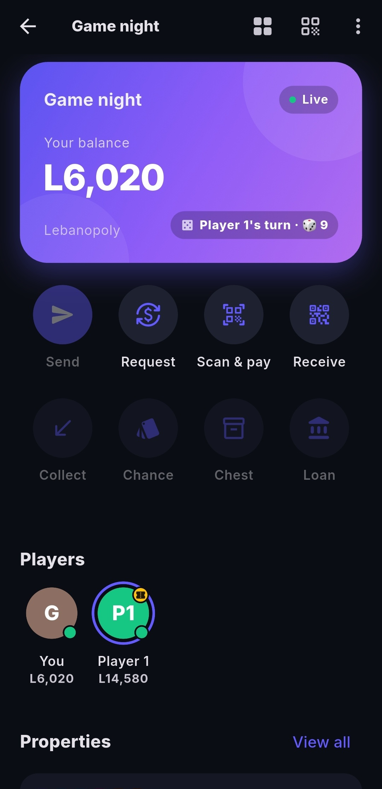
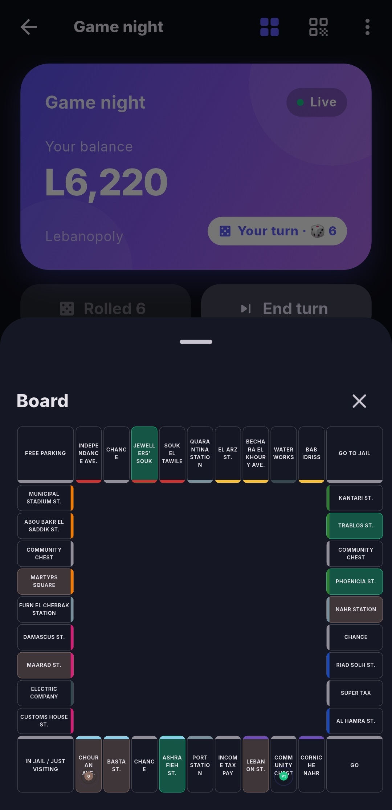
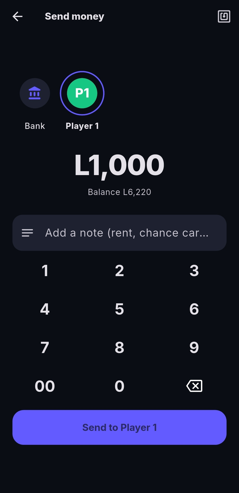
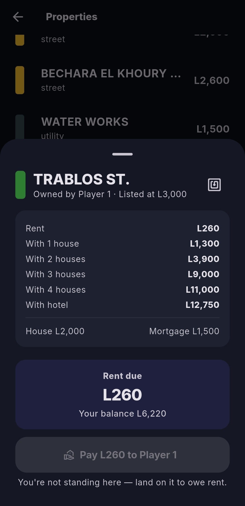
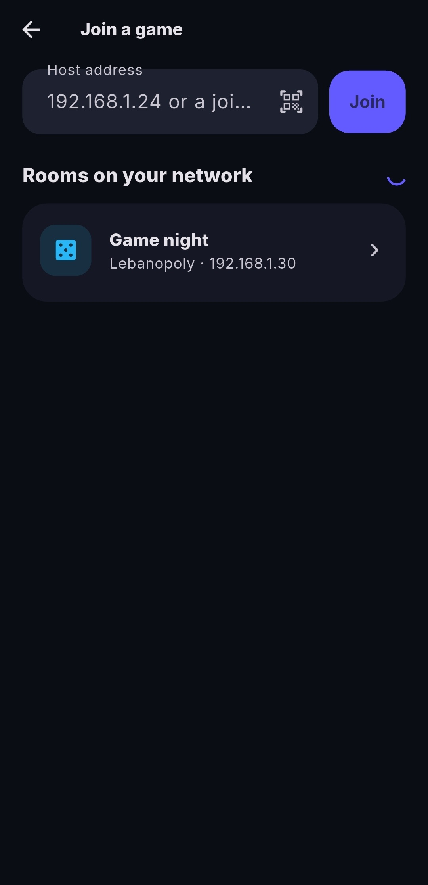
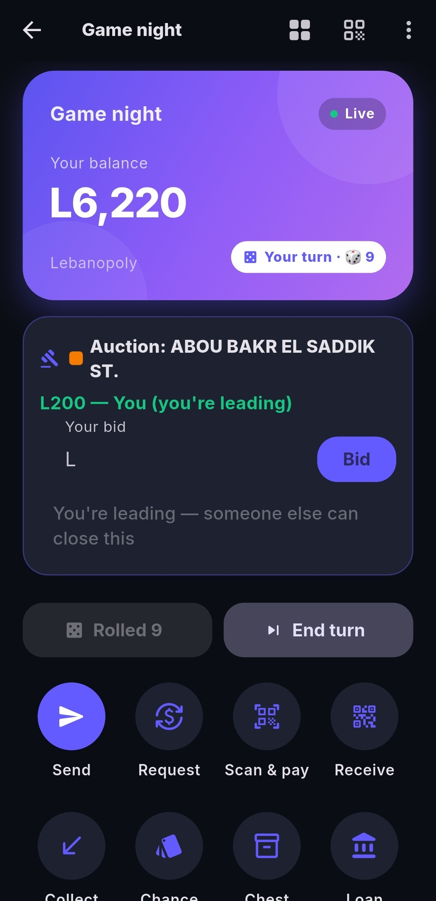
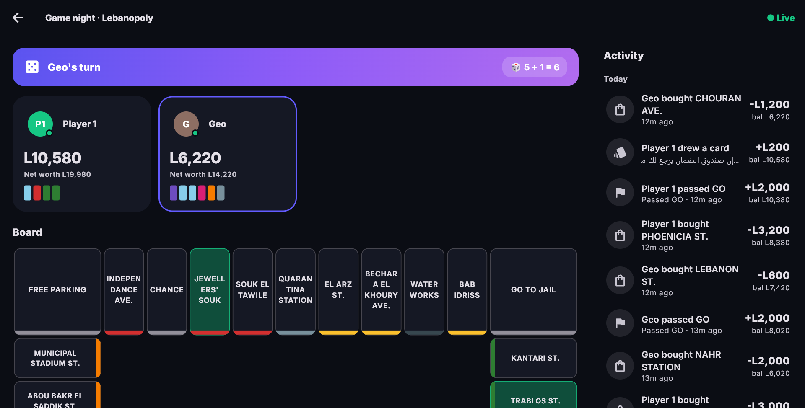

# Digipoly

**Play Monopoly-style board games without the paper money.** Keep your real
board, dice and tokens on the table — everyone's phone becomes their wallet
instead. Don't have a board on hand? Boards with a full layout render right
in the app, tokens and all, so you can play with nothing but your phones.



It's built to feel like a real banking app, not a boardgame counter —
balance card, send/request money, an activity feed of every payment, even
tap-to-pay with NFC. No accounts, no sign-up, no internet required — it all
runs over your own wifi, phone to phone, for as long as game night lasts.

## Download

Grab the latest build from the [Releases page](https://github.com/georges-ph/digipoly/releases):

- **Android** — download the `.apk` and install it (you may need to allow
  "install from unknown sources" once).
- **Windows** — download the `.zip`, extract it anywhere, and run the
  `.exe` inside — keep it together with the files next to it.
- **iPhone** — there's no App Store version, but you don't need one: whoever
  hosts the game can show a QR code that opens Digipoly straight in Safari,
  no install at all. See "Joining without installing anything" below.

## How it works

One player **hosts** the game from their phone or PC — their device becomes
the bank. Everyone else **joins** over wifi, either by opening the app or by
scanning a QR code in a browser. From then on:

- Buying a property, paying rent, collecting your salary from GO — it's all
  a few taps, and shows up live on everyone else's screen.
- Sending money to another player, or asking them for some, works like any
  payment app: pick who, enter the amount, they approve it.
- A shared dashboard can be put up on a TV or laptop so the whole table can
  see balances and the board at a glance.
- No board? Tap the board icon to see a live view of the whole layout —
  everyone's token, every property, right on your screen.

### Starting a game

1. Open Digipoly, tap **Host**, and pick (or create) a board — it just needs
   to match the board you have on the table (properties, prices, currency).
2. Share the room: everyone on the same wifi can find it automatically, or
   scan the QR code shown on the host's screen.
3. Once everyone's joined, play the board game as normal — just use the app
   any time money would change hands.

### Joining without installing anything

Tap "Join" and pick the room from the list, or scan the host's QR code with
your phone's camera — on an iPhone this opens the game directly in Safari,
no app required.

## Screenshots

| | |
|---|---|
|  |  |
|  |  |
|  |  |



*A shared dashboard for any TV or laptop at the table.*

## Features

- **Banking**: send money, collect from the bank, get paid for passing GO,
  request money from another player (they approve it on their own phone)
- **Properties**: buy, build houses and hotels, pay rent — the app works
  out the amount automatically
- **Board view**: see everyone's token move around the board live
- **Auctions**: decline to buy and the table can bid on it live
- **Dashboard**: put the game up on a TV or laptop for everyone to see
- **NFC cards** (Android): tap a physical card to buy a property or pay rent
- **Resilient**: if your phone dies or you lose wifi, your seat and balance
  are still there when you reconnect — even after restarting the app
- **Board editor**: build your own board (currency, properties, rents,
  Chance/Community Chest cards) and reuse it every game night

## For developers

```
flutter pub get
flutter run            # Windows, Android
flutter test
```

The project is intentionally flat: `lib/models`, `lib/services`,
`lib/providers`, `lib/screens`, `lib/widgets`, `lib/theme`. No code
generation, no build_runner. State management is `provider`; networking is
`shelf`/`shelf_web_socket` on the host and `web_socket_channel` on clients,
with `bonsoir` for room discovery (mDNS).

### Bundling the web app

The host can also serve the app itself over plain HTTP, which is what makes
QR-code joining from a browser possible. Bundle it once before building:

```
.\tool\bundle_web_app.ps1
flutter build apk             # rebuild so the asset ships
```

See [PROJECT.md](PROJECT.md) for the full architecture, protocol, and game
rules reference, and [CLAUDE.md](CLAUDE.md) for the conventions given to the
AI assistant that helped write the code.

## About this project

Digipoly's architecture, game rules, and UX were designed by the author; the
implementation was written with Claude (Anthropic) as a pair-programming
assistant, with every change reviewed and tested by the author before being
kept.

## License

MIT — see [LICENSE](LICENSE).
